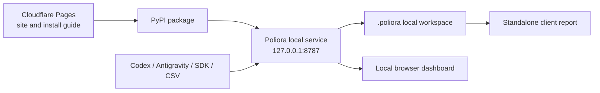

# Poliora Hosting And Launch Architecture

## Launch Architecture

Poliora v0.1 is a local-first product, not a public multi-tenant dashboard.

1. `poliora.com` is a static product, documentation, and installation site
   hosted on Cloudflare Pages.
2. The Python package is distributed through PyPI and installed with
   `pip install poliora`. Native Windows and macOS archives are attached to
   GitHub Releases, not stored in the Pages site.
3. `poliora dashboard` starts the application on `http://127.0.0.1:8787`.
4. Provider wrappers, CSV import, Codex, and Antigravity write metadata to the
   current project's `.poliora` directory.
5. The browser talks only to the local process. Customer prompts, replies, code,
   usage events, contract rates, and savings decisions do not pass through an
   Poliora cloud service.

Do not expose port `8787` to the internet. A future hosted product needs a
separate authenticated service, organization isolation, encrypted secrets,
rate limits, audit logs, backups, and a production database.

## Recommended Services

### Launch

- **Product site:** Cloudflare Pages free plan.
- **Package:** PyPI with GitHub Actions trusted publishing.
- **Source and CI:** GitHub.
- **Product runtime:** the customer's laptop or server.
- **Support:** one dedicated email address and a public issue tracker.
- **Analytics:** none at first, or privacy-preserving page analytics only after
  the privacy statement names it.

This can launch with hosting cost near zero, excluding the domain. It also
keeps the strongest privacy claim simple: Poliora cannot leak usage data that
it never receives.

The static launch site is ready in `site/`. In Cloudflare Pages, choose no
framework, leave the build command empty, and set the output directory to
`site`. The included `_headers` file applies the launch security policy. Do not
put native executables in `site/`: Cloudflare Pages limits individual assets to
25 MiB. The release workflow produces `Poliora-Windows.zip` and
`Poliora-macOS.zip` for GitHub Releases instead.

### Hosted Pilot Later

Use Cloudflare Workers and D1 only for accounts, licenses, update metadata, and
an opt-in ingestion API. The infrastructure can begin cheaply, but
authentication and tenant isolation matter more than the hosting bill. Do not
begin this phase until local pilots prove that customers need cross-device or
team access.

## Release Accounts Still Needed

- GitHub organization or repository and its remote URL.
- PyPI project ownership and trusted-publisher configuration.
- Domain name and Cloudflare account.
- Support email address.
- Stripe only after the paid pilot offer is validated.

No provider API key is needed to publish the local product. Customer provider
keys are only needed for integrations that query their provider account.

## Go-Live Sequence

1. Run the full release gate in `docs/LAUNCH_CHECKLIST.md`.
2. Create the public Git repository and run the hosted Windows/Linux CI matrix.
3. Publish a release candidate to TestPyPI and install it on a clean Windows
   account.
4. Publish `poliora` to PyPI.
5. Connect the static site repository to Cloudflare Pages and attach the domain.
6. Onboard three design partners manually before spending heavily on ads.
